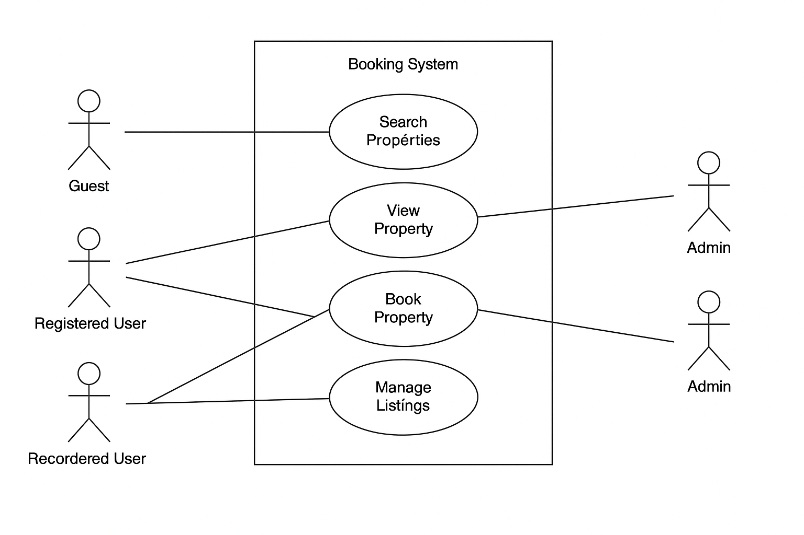

## What is Requirement Analysis?

Requirement Analysis is a critical phase in the Software Development Life Cycle (SDLC) where developers, project managers, and stakeholders gather and define what the software product should achieve. It is the foundation of any successful software project, ensuring that all parties have a clear and shared understanding of the goals, features, and constraints of the system.

### 🔍 Why Requirement Analysis Matters:

- **Clarity & Focus:** It helps eliminate ambiguity by clearly documenting user expectations and business needs.
- **Project Scope:** Prevents scope creep by outlining exactly what will be delivered.
- **Efficient Design & Development:** Acts as a blueprint for system architecture, UI/UX design, and coding practices.
- **Time & Cost Estimation:** Supports accurate project planning by identifying resource needs early.
- **Quality Assurance:** Helps in testing and validation to ensure the product meets stakeholder expectations.

In summary, requirement analysis lays the groundwork for building reliable, efficient, and user-friendly software systems that solve real-world problems.

---

## Why is Requirement Analysis Important?

Requirement Analysis plays a vital role in the Software Development Life Cycle (SDLC) because it ensures that all stakeholders are aligned before any code is written. Here are three key reasons why it is critical:

### 1. 🔍 Clarity and Shared Understanding  
It helps stakeholders, developers, and designers clearly understand the expectations and functionalities of the system. This reduces confusion, eliminates assumptions, and ensures everyone is working toward the same goal.

### 2. 📐 Accurate Scope Definition  
Requirement Analysis helps define the exact scope of the project. With a well-defined scope, teams can prevent **scope creep** (the tendency for project requirements to increase over time), keeping development on track and within budget.

### 3. 💰 Better Cost and Time Estimation  
With clear requirements, project managers can estimate timelines, budgets, and resource needs more accurately. This minimizes risks of delays and overspending, improving the chances of delivering a successful product.

### 4. ✅ Higher Quality Deliverables  
Since requirements are validated and documented early, it becomes easier to test and verify whether the final product meets user needs, leading to improved quality and stakeholder satisfaction.

---

## Key Activities in Requirement Analysis

Requirement Analysis involves a series of structured steps to ensure a shared understanding of what the system should do. Below are the five key activities:

### 1. 📥 Requirement Gathering
- Conduct interviews with stakeholders to collect information.
- Use surveys, questionnaires, and workshops to gather input from various sources.
- Observe end users to understand how they currently perform tasks.
- Analyze existing documentation and systems to identify existing requirements.

### 2. ✍️ Requirement Elicitation
- Organize brainstorming sessions to explore ideas and expectations.
- Use focus groups to dig deeper into user needs and challenges.
- Develop prototypes to help users visualize the system and refine their requirements.

### 3. 📚 Requirement Documentation
- Create a detailed **Requirement Specification Document** covering all functionalities.
- Write **user stories** from the perspective of the user.
- Develop **use case diagrams** to map interactions between users and the system.

### 4. 📊 Requirement Analysis and Modeling
- Prioritize requirements based on business value and feasibility.
- Perform feasibility analysis (technical, financial, and time-related).
- Build models such as data flow diagrams and entity-relationship diagrams to visualize requirements.

### 5. ✅ Requirement Validation
- Review documented requirements with stakeholders to confirm accuracy and completeness.
- Define **acceptance criteria** for each feature or requirement.
- Create a **traceability matrix** to ensure each requirement is addressed during development and testing.

---

## Types of Requirements

In software development, requirements are broadly categorized into **Functional Requirements** and **Non-functional Requirements**. Understanding both is crucial for building systems that meet user needs and operate efficiently.

### ⚙️ Functional Requirements

**Definition:**  
Functional requirements describe the specific behaviors, features, and functions that the system must support. They define **what** the system should do.

**Examples for Booking Management System:**
- 🔍 **Search Properties:** Users can search for properties based on filters like location, price, and availability.
- 👤 **User Registration & Login:** Users can create accounts and log in securely.
- 🏠 **Property Listings:** Display available properties with images, descriptions, and pricing.
- 📅 **Booking System:** Users can book a property, select dates, and view booking details.
- 📩 **Booking Confirmation:** After successful booking, users receive a confirmation email.

---

### 🛡️ Non-functional Requirements

**Definition:**  
Non-functional requirements describe **how** the system performs rather than what it does. They cover quality attributes like speed, scalability, security, and usability.

**Examples for Booking Management System:**
- ⚡ **Performance:** The system should load search results within 2 seconds.
- 🔒 **Security:** User data must be encrypted, and the system should protect against common vulnerabilities like SQL injection.
- 📈 **Scalability:** The system must support up to 10,000 users simultaneously during peak usage.
- 🧭 **Usability:** The UI should be intuitive, responsive, and mobile-friendly.
- 🕒 **Reliability:** System uptime must be 99.9%, with fast recovery during outages.

---

## Use Case Diagrams

Use case diagrams help visualize the interactions between users (actors) and the system. They represent how different types of users interact with various features of a software system, making it easier to understand system functionality.

### Benefits of Use Case Diagrams:
- Provide a clear visual representation of system functionalities
- Help identify user roles and system interactions
- Improve communication between stakeholders and developers

### Booking System Use Case Diagram:

---

## Acceptance Criteria

Acceptance criteria define the conditions that a software product must meet to be accepted by stakeholders. They are used to clarify requirements, ensure shared understanding, and guide both development and testing.

### Importance of Acceptance Criteria:
- ✅ Ensures the feature meets stakeholder expectations
- ✅ Reduces ambiguity in requirements
- ✅ Serves as the basis for test cases
- ✅ Helps determine when a task is “done”

### Example: Checkout Feature – Booking Management System

**Acceptance Criteria:**
- The user must be able to select a property and view the total cost before confirming the booking.
- The user must provide valid payment information before proceeding.
- Once payment is successful, a confirmation page with booking details must be shown.
- A confirmation email must be sent to the user within 2 minutes of completing the checkout.
- The system should prevent duplicate bookings for the same time slot.

